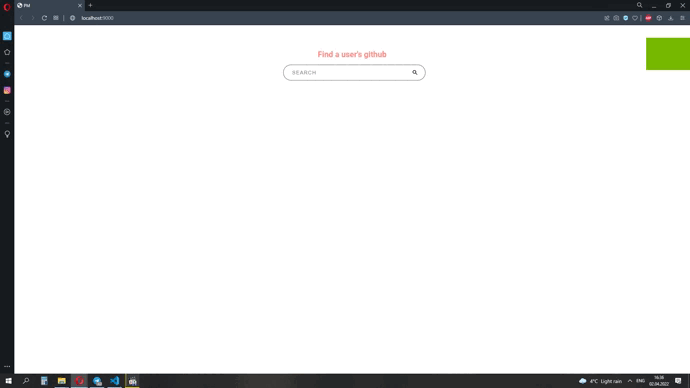

# Github user search
Made a small search engine for a specific user using the delay mechanism - debounce
## To launch this project
```
npm install // load all packages
npm run dev // launch project on local host
npm run test // start all tests
npm run testcov // check coverage on code
```
## What does it look like 

